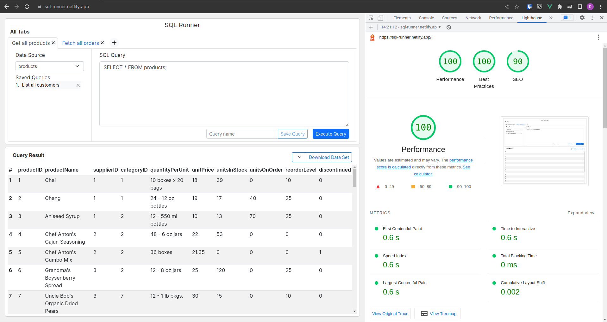

# SQL Runner

## Link to the live app: https://sql-runner.netlify.app


### Overview

Dummy frontend app which simulates the behavior to run SQL query and display the result in a tabular format. It allows to open multiple tabs and run different queries. User can save a query for later use. The result can be downloaded.

The SQL query is not run on any real backend. The data displayed is dummy json data taken from [here](https://github.com/graphql-compose/graphql-compose-examples/tree/master/examples/northwind/data/csv)

### Features

1. Run SQL query and display the results in a table
2. Open different tabs to run multiple queries simultaneously
3. Save a query for later use
4. Download the results as json

### Good to have

1. A web based code editor which can help autocomplete SQL code and provide syntax highlighting (Eg: https://codemirror.net/)
2. [Virtual scroll](https://blog.logrocket.com/virtual-scrolling-core-principles-and-basic-implementation-in-react/) to optimize rendering if the requirement is to display large amount of rows (Eg: https://github.com/Akryum/vue-virtual-scroller/tree/master/packages/vue-virtual-scroller)
3. Sorting & Pagination (Skipped as we do not use any real backend for this app)
4. Download as other formats
5. Loaders/Progress bar to acknowledge user's actions & display status when the query is run on a real backend

### Performance

[Lighthouse](https://developer.chrome.com/en/docs/lighthouse/) is used to measure the performance of the app



### Tech Stack & Dependencies

1. [VueJs](https://vuejs.org/) - JavaScript framework
2. [Vuex](https://vuex.vuejs.org/) - Sate management
3. [Bootstrap](https://getbootstrap.com/) - CSS framework
4. [icongram](https://icongr.am/) - Icons
5. [Google Fonts](https://fonts.google.com/)
6. [uniqid](https://www.npmjs.com/package/uniqid) - Unique id generator
7. [Vite](https://vitejs.dev/) - Frontend build tool
8. [Netlify](https://www.netlify.com/) - Frontend app hosting

### Run the project locally

**Project Setup**

```sh
yarn install
```

**Compile and Hot-Reload for Development**

```sh
yarn start
```

**Local app URL**

http://localhost:8080

**Compile and Minify for Production**

```sh
yarn build
```

**Lint with [ESLint](https://eslint.org/)**

```sh
yarn lint
```
